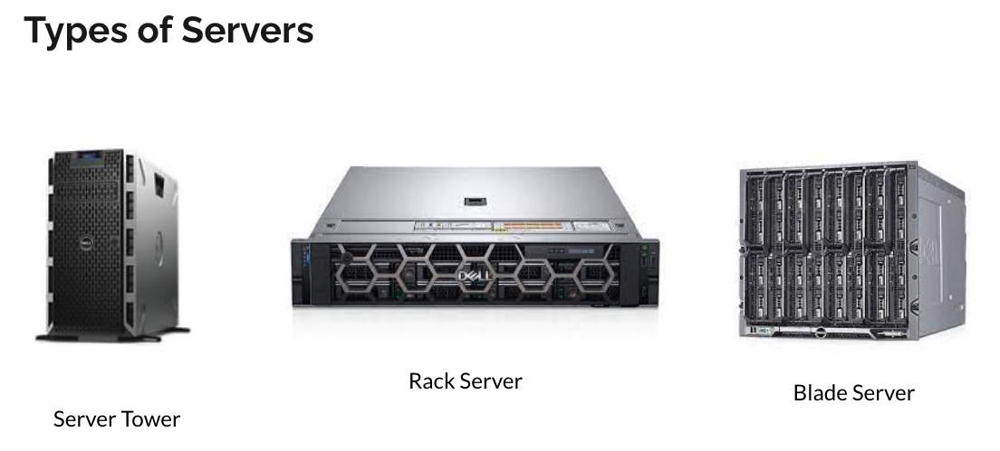
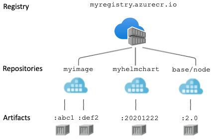
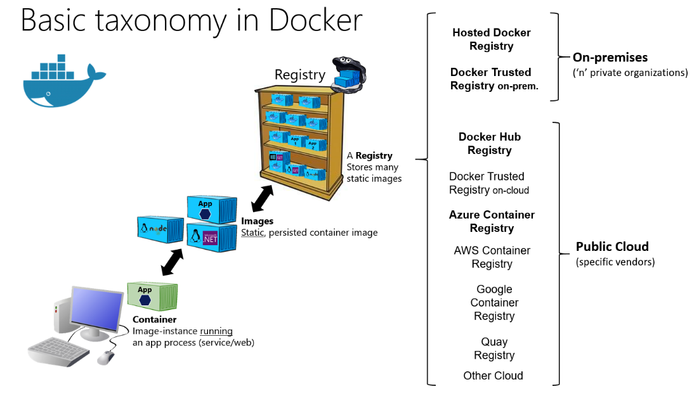

# Coaching | SCTP in SE | Module 4 | DevOps Week 2

<details>
<summary><b>1. Docker Commands Quiz</b></summary>

Test your Docker command knowledge with the following quiz.

### Q1: Which command is used to build a Docker image?
- **A:** `docker build` (Correct)
- **B:** `docker ps`
- **C:** `docker ls`
- **D:** `docker image ls`

### Q2: What could cause a `docker build` command to fail?
- **A:** Incorrect directory
- **B:** Docker not installed (Correct)
- **C:** Missing Dockerfile in the directory (Correct)
- **D:** Docker Compose not installed

### Q3: Which command runs an image as a container?
- **A:** `docker build`
- **B:** `docker run` (Correct)
- **C:** `docker ps`
- **D:** `docker launch`

### Q4: How can you list containers that are currently running?
- **A:** `docker build`
- **B:** `docker ps` (Correct)
- **C:** `docker ls`
- **D:** `docker launch`

### Q5: Docker is exclusively used for production environments and is not suitable for development.
- **A:** True
- **B:** False (Correct)

</details>

<details>
<summary><b>2. Servers & Virtualization Explained</b></summary>

### Servers

Initially, applications were hosted on bare-metal servers, each containing a single operating system.

### Virtualization

Virtualization technology creates multiple virtual instances from physical resources, utilizing a hypervisor to manage and isolate these environments, enhancing efficiency and reducing the need for physical hardware.

### Virtualization vs Containers

While virtualization splits a single server into several virtual machines, containers share the OS kernel but isolate application processes, offering a lightweight and efficient alternative, particularly suited for microservices and cloud-native applications.

</details>

<details>
<summary><b>3. Demystifying Docker</b></summary>

### Dockerfile
- Defines the container environment. Docker builds images from Dockerfiles, specifying base images, files, commands, and configurations.

### Docker Image
- Immutable packages containing everything needed to run an application. Stored in Docker registries like Docker Hub, they're foundational for creating containers.

### Docker Container
- Runtime instances of Docker images, isolating applications and their dependencies from the underlying system and each other.

### Image Registry

A hub for storing, sharing, and managing Docker images. Docker Hub and private registries like Amazon ECR and Azure ACR facilitate image distribution and version control.

</details>

<details>
<summary><b>4. Mastering Docker Compose</b></summary>



Learn how Docker Compose orchestrates multi-container applications, simplifying deployment and scaling with YAML configuration files. Explore an example `docker-compose.yml` file [here](https://github.com/edisonzsq/sample-docker-compose/blob/main/docker-compose.yml).

</details>

<details>
<summary><b>5. Practical Challenge: Containerize a Java Application</b></summary>

Containerize your Module 3 Java application for a hands-on Docker Compose experience.

### Challenge Repository
Explore and utilize this [Spring Boot demo](https://github.com/edisonzsq/spring-boot-demo) repository.

### Commands to Begin

```
git clone https://github.com/edisonzsq/spring-boot-demo
cd spring-boot-demo
git checkout docker_compose_with_postgres
docker compose up
```

Refer to the `README.md` for API endpoint testing instructions.

</details>
